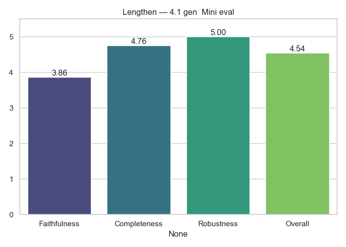

# Lengthen Analytics

**Generator → Evaluator:** `4.1_gen__Mini_eval`

## Average Scores

|              |   Score |
|:-------------|--------:|
| Faithfulness |  3.86   |
| Completeness |  4.76   |
| Robustness   |  5      |
| Overall      |  4.5414 |

## Notes
- Cross-model evaluation (no self-judging)
- Scores averaged across full dataset

