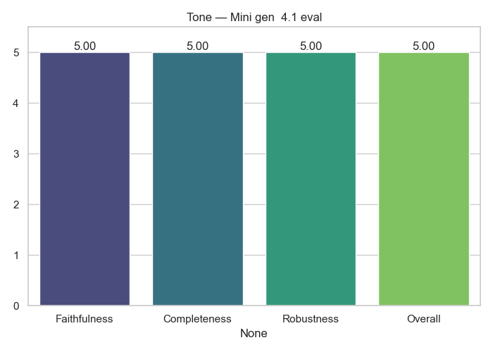

# Tone Analytics

**Generator → Evaluator:** `Mini_gen__4.1_eval`

## Average Scores

|              |   Score |
|:-------------|--------:|
| Faithfulness |       5 |
| Completeness |       5 |
| Robustness   |       5 |
| Overall      |       5 |

## Notes
- Cross-model evaluation (no self-judging)
- Scores averaged across full dataset

