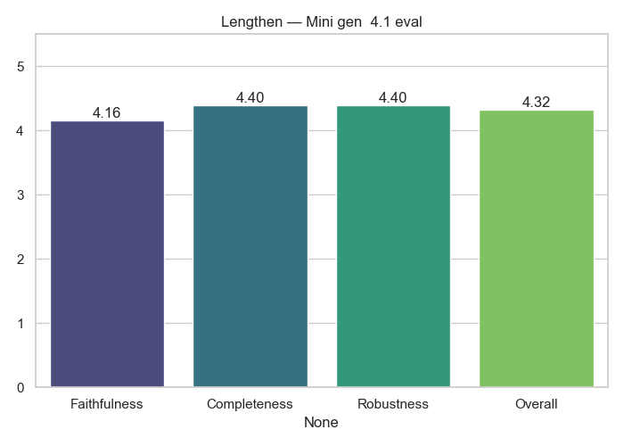

# Lengthen Analytics

**Generator → Evaluator:** `Mini_gen__4.1_eval`

## Average Scores

|              |   Score |
|:-------------|--------:|
| Faithfulness |  4.16   |
| Completeness |  4.4    |
| Robustness   |  4.4    |
| Overall      |  4.3208 |

## Notes
- Cross-model evaluation (no self-judging)
- Scores averaged across full dataset

