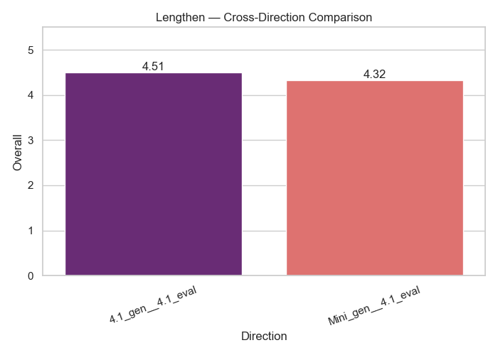

# Lengthen — Cross Evaluation Comparison

This compares **directional evaluations**:
- 4.1 → Mini
- Mini → 4.1

| Direction          |   Overall |
|:-------------------|----------:|
| 4.1_gen__4.1_eval  |    4.5076 |
| Mini_gen__4.1_eval |    4.3208 |

