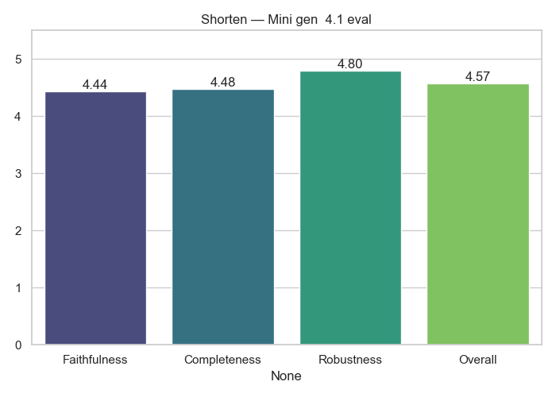

# Shorten Analytics

**Generator → Evaluator:** `Mini_gen__4.1_eval`

## Average Scores

|              |   Score |
|:-------------|--------:|
| Faithfulness |  4.44   |
| Completeness |  4.48   |
| Robustness   |  4.8    |
| Overall      |  4.5724 |

## Notes
- Cross-model evaluation (no self-judging)
- Scores averaged across full dataset

