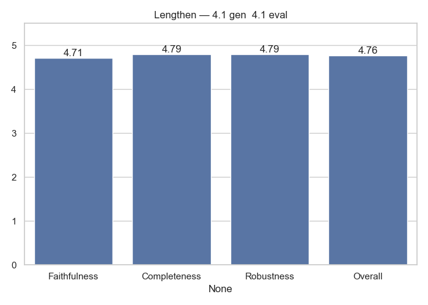

# Lengthen Analytics

**Generator → Evaluator:** `4.1_gen__4.1_eval`

## Average Scores

|              |   Score |
|:-------------|--------:|
| Faithfulness | 4.70833 |
| Completeness | 4.79167 |
| Robustness   | 4.79167 |
| Overall      | 4.76417 |

## Notes
- Evaluation performed only by GPT-4.1
- Scores averaged across dataset

