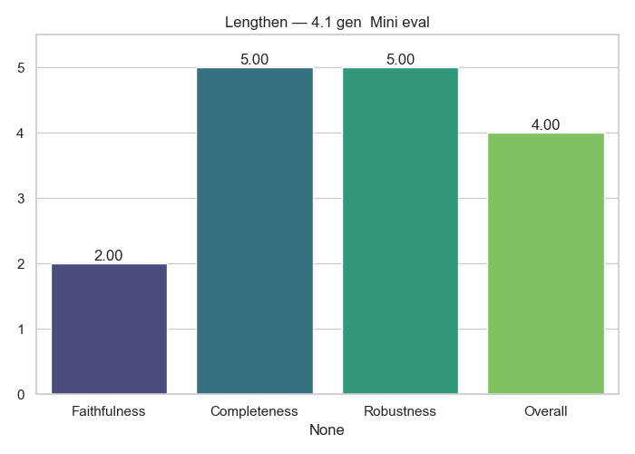

# Lengthen Analytics

**Generator → Evaluator:** `4.1_gen__Mini_eval`

## Average Scores

|              |   Score |
|:-------------|--------:|
| Faithfulness | 3.21277 |
| Completeness | 4.29787 |
| Robustness   | 4.76596 |
| Overall      | 4.0934  |

## Notes
- Cross-model evaluation (no self-judging)
- Scores averaged across full dataset

