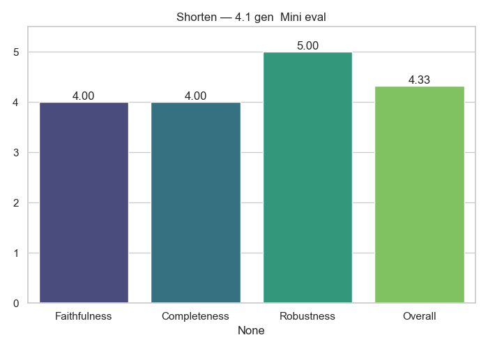

# Shorten Analytics

**Generator → Evaluator:** `4.1_gen__Mini_eval`

## Average Scores

|              |   Score |
|:-------------|--------:|
| Faithfulness |    4    |
| Completeness |    4    |
| Robustness   |    5    |
| Overall      |    4.33 |

## Notes
- Cross-model evaluation (no self-judging)
- Scores averaged across full dataset

