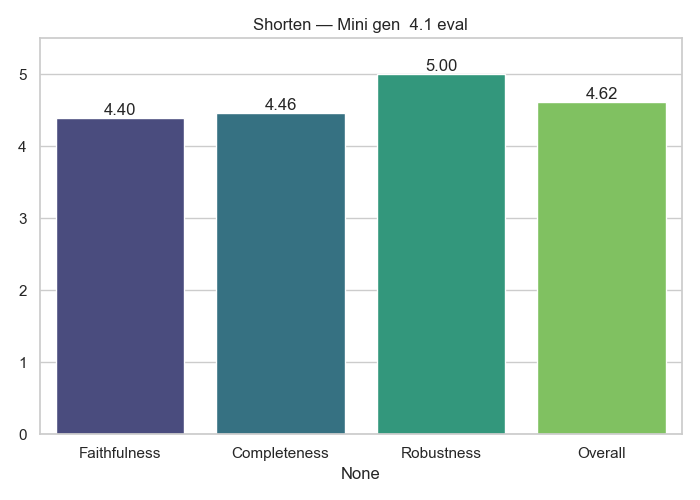

# Shorten Analytics

**Generator → Evaluator:** `Mini_gen__4.1_eval`

## Average Scores

|              |   Score |
|:-------------|--------:|
| Faithfulness |   4.6   |
| Completeness |   4.6   |
| Robustness   |   4.8   |
| Overall      |   4.666 |

## Notes
- Evaluation performed only by GPT-4.1
- Scores averaged across dataset

