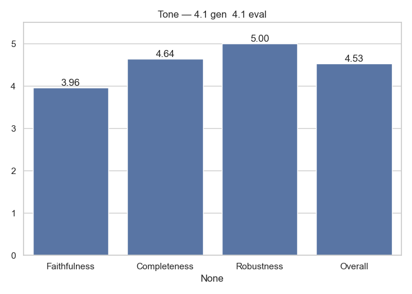

# Tone Analytics

**Generator → Evaluator:** `4.1_gen__4.1_eval`

## Average Scores

|              |   Score |
|:-------------|--------:|
| Faithfulness |   3.96  |
| Completeness |   4.64  |
| Robustness   |   5     |
| Overall      |   4.534 |

## Notes
- Evaluation performed only by GPT-4.1
- Scores averaged across dataset

