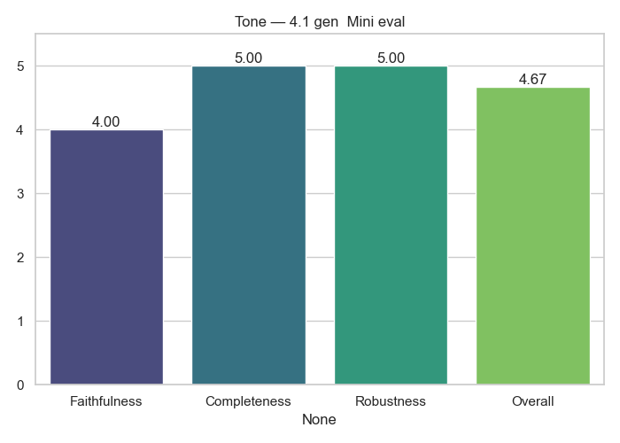

# Tone Analytics

**Generator → Evaluator:** `4.1_gen__Mini_eval`

## Average Scores

|              |   Score |
|:-------------|--------:|
| Faithfulness |  2.1    |
| Completeness |  3.46   |
| Robustness   |  5      |
| Overall      |  3.5194 |

## Notes
- Cross-model evaluation (no self-judging)
- Scores averaged across full dataset

