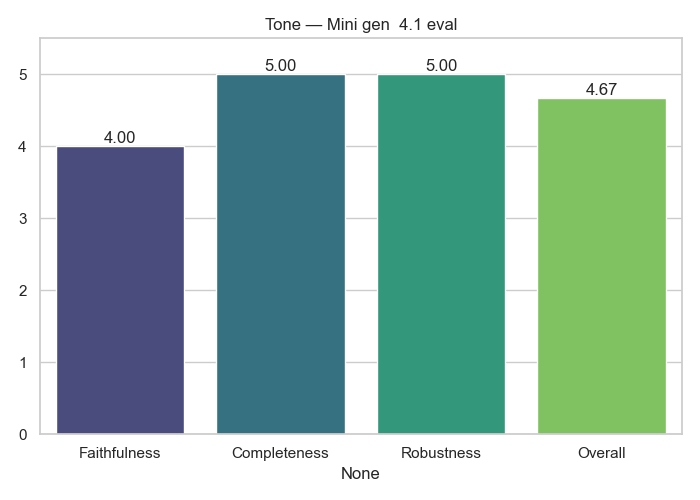

# Tone Analytics

**Generator → Evaluator:** `Mini_gen__4.1_eval`

## Average Scores

|              |   Score |
|:-------------|--------:|
| Faithfulness |  3.44   |
| Completeness |  4.32   |
| Robustness   |  5      |
| Overall      |  4.2536 |

## Notes
- Evaluation performed only by GPT-4.1
- Scores averaged across dataset

